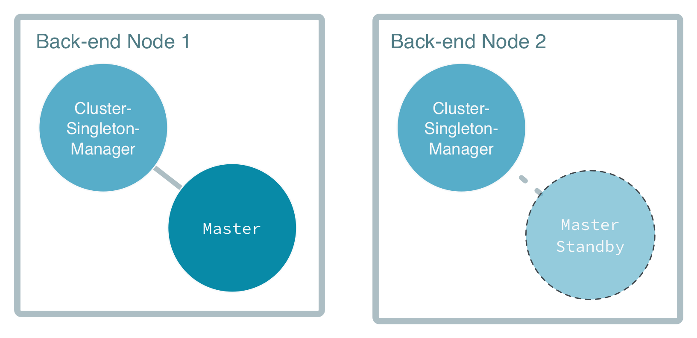

# The Back-End Nodes

The back-end nodes host the `Master` actor, which manages work, keeps track of available workers, and notifies registered workers when new work is available. The single `Master` actor is the heart of the solution, with built-in resilience provided by the [Akka Cluster Singleton](http://doc.akka.io/docs/akka/current/scala/guide/modules.html#cluster-singleton).

## The Master singleton

The [Cluster Singleton](http://doc.akka.io/docs/akka/current/scala/guide/modules.html#cluster-singleton) tool in Akka makes sure an actor only runs concurrently on one node within the subset of nodes marked with the role `back-end` at any given time. It will run on the oldest back-end node. If the node on which the 'Master' is running is removed from the cluster, Akka starts a new `Master` on the next oldest node. Other nodes in the cluster interact with the `Master` through the `ClusterSingletonProxy` without knowing the explicit location. You can see this interaction in the `FrontEnd` and `Worker` actors.

In case of the master node crashing and being removed from the cluster another master actor is automatically started on the new oldest node.

You can see how the master singleton is started in the method `init`
in `MasterSingleton`:

@@snip [MasterSingleton.scala]($g8src$/scala/worker/MasterSingleton.scala) { #singleton }

The singleton accepts the `Behavior` of the actual singleton actor, as well as configuration 
which allows us to decide that the singleton actors should only run on the nodes with the role `back-end`.

Calls to `init` on nodes without the `back-end` role will result in a proxy to communicate with the singleton
being created.

The state of the master is recovered on the standby node in the case of the node being lost through event sourcing.

An alternative to event sourcing and the singleton master would be to keep track of all jobs in a central database, but that is more complicated and not as scalable. In the end of the tutorial we will describe how multiple masters can be supported with a small adjustment.

Let's now explore the implementation of the `Master` actor in depth.
