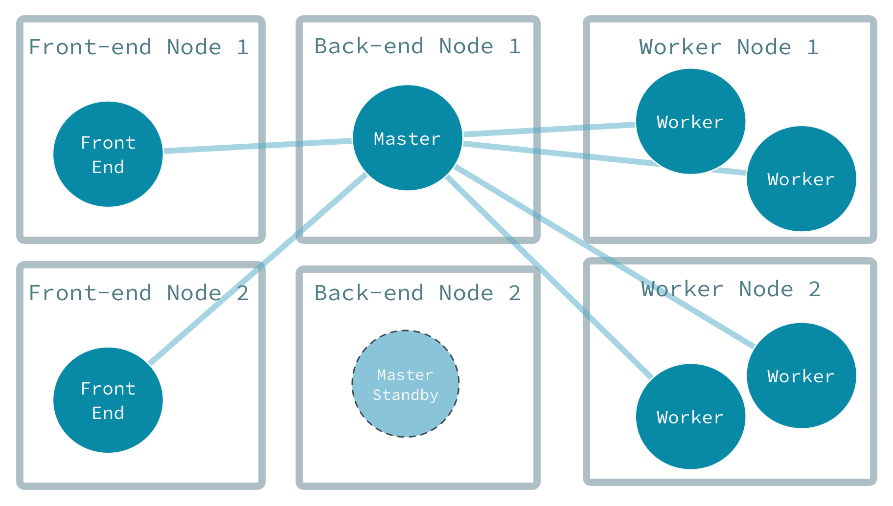

# Akka Distributed Workers with Scala Guide
 
Akka is a toolkit and runtime for building highly concurrent, distributed, and fault-tolerant event-driven applications on the JVM. Akka can be used with both Java and Scala.

This guide introduces Akka clusters by describing the Scala version of a distributed workers example. 

A Java version of the guide is not yet available but will be soon, so check back in a while!

The guide contains advanced usage of Akka and requires familiarity with Akka and Actors. If you have no previous experience with Actors you should start with the [Akka Quickstart with Scala](http://developer.lightbend.com/guides/akka-quickstart-scala/), which goes through the basics.

## Example overview

To be reactive, distributed applications must deal gracefully with temporary and prolonged outages as well as have the ability to scale up and down to make the best use of resources. Akka clustering provides these capabilities so that you don't have to implement them yourself. The distributed workers example demonstrates the following Akka clustering capabilities:

 * elastic addition and removal of the front-end actors that accept client requests
 * elastic addition and removal of the back-end actors that perform the work distribution of actors across different nodes
 * how jobs are re-tried in the face of failures

But before we dive into how the example accomplishes these goals, download the example and try it out!

The design is based on Derek Wyatt's blog post [Balancing Workload Across Nodes with Akka 2](http://letitcrash.com/post/29044669086/balancing-workload-across-nodes-with-akka-2) from 2009, which is a bit old, but still a good description of the advantages of letting the workers pull work from the master instead of pushing work to the workers.

## Downloading the example 

The Akka Distributed Workers example for Scala is a zipped project that includes a distribution of sbt (build tool). You can run it on Linux, MacOS, or Windows. The only prerequisite is Java 8.

Download and unzip the example:

1. Download the zip file from [Lightbend Tech Hub](http://dev.lightbend.com/start/?group=akka&project=akka-distributed-workers-scala) by clicking `CREATE A PROJECT FOR ME`. 
1. Extract the zip file to a convenient location: 
  - On Linux and MacOS systems, open a terminal and use the command `unzip akka-distributed-workers-scala.zip`. Note: On MacOS, if you unzip using Archiver, you also have to make the sbt files executable:
```
 $ chmod u+x ./sbt
 $ chmod u+x ./sbt-dist/bin/sbt
```
  - On Windows, use a tool such as File Explorer to extract the project. 

## Running the example

To run the sample application, which starts a small cluster inside of the same JVM instance:

1. In a console, change directories to the top level of the unzipped project.
 
    For example, if you used the default project name, akka-distributed-workers-scala, and extracted the project to your root directory,
    from the root directory, enter: `cd akka-distributed-workers-scala`

1. Enter `./sbt` on MacOS/Linux or `sbt.bat` on Windows to start sbt.
 
    sbt downloads project dependencies. The `>` prompt indicates sbt has started in interactive mode.

1. At the sbt prompt, enter `run`.
 
    sbt builds the project and runs the `Main` of the project:

After waiting a few seconds for the cluster to form the output should start look _something_ like this (scroll all the way to the right to see the Actor output):
 
```
[INFO] [07/21/2017 17:41:53.320] [ClusterSystem-akka.actor.default-dispatcher-16] [akka.tcp://ClusterSystem@127.0.0.1:51983/user/producer] Produced work: 3
[INFO] [07/21/2017 17:41:53.322] [ClusterSystem-akka.actor.default-dispatcher-3] [akka.tcp://ClusterSystem@127.0.0.1:2551/user/master/singleton] Accepted work: 3bce4d6d-eaae-4da6-b316-0c6f566f2399
[INFO] [07/21/2017 17:41:53.328] [ClusterSystem-akka.actor.default-dispatcher-3] [akka.tcp://ClusterSystem@127.0.0.1:2551/user/master/singleton] Giving worker 2b646020-6273-437c-aa0d-4aad6f12fb47 some work 3bce4d6d-eaae-4da6-b316-0c6f566f2399
[INFO] [07/21/2017 17:41:53.328] [ClusterSystem-akka.actor.default-dispatcher-2] [akka.tcp://ClusterSystem@127.0.0.1:51980/user/worker] Got work: 3
[INFO] [07/21/2017 17:41:53.328] [ClusterSystem-akka.actor.default-dispatcher-16] [akka.tcp://ClusterSystem@127.0.0.1:51980/user/worker] Work is complete. Result 3 * 3 = 9.
[INFO] [07/21/2017 17:41:53.329] [ClusterSystem-akka.actor.default-dispatcher-19] [akka.tcp://ClusterSystem@127.0.0.1:2551/user/master/singleton] Work 3bce4d6d-eaae-4da6-b316-0c6f566f2399 is done by worker 2b646020-6273-437c-aa0d-4aad6f12fb47
```
   
Congratulations, you just ran your first Akka Cluster app. Now take a look at what happened under the covers. 

## What happens when you run it

When `Main` is run without any parameters, it starts six `ActorSystem`s in the same JVM. These six `ActorSystem`s form a single cluster. The six nodes include two each that perform front-end, back-end, and worker tasks:

 * The front-end nodes simulate an external interface, such as a REST API, that accepts workloads from clients.
 * The worker nodes have worker actors that accept and process workloads.
 * The back-end nodes contain a Master actor that coordinates workloads, keeps track of the workers, and delegates work to available workers. One of the nodes is active and one is on standby. If the active Master goes down, the standby takes over.

A bird's eye perspective of the architecture looks like this:



Let's look at the details of each part of the application, starting with the front-end.

@@@index

* [The Front-end Nodes](front-end.md)
* [The Back-end Nodes](back-end.md)
* [The Master Actor in Detail](master-in-detail.md)
* [The Worker Nodes](worker.md)
* [Experimenting with the example](experimenting.md)
* [Next Steps](next-steps.md)

@@@